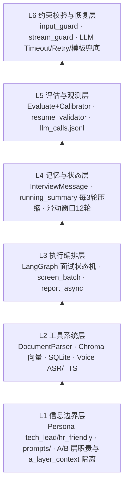

# AI 招聘助手 

> **在线演示**：https://nainong.tech/airecruit/

智能招聘演示系统：**场景 A（简历解析与筛选）+ 场景 B（LangGraph 模拟面试 Agent）** 端到端串联，覆盖从非结构化输入到结构化招聘决策的完整闭环。

技术栈：FastAPI · LangGraph · DashScope (Qwen) · SQLite · Chroma · 原生 HTML/JS

---

## 交付物清单

| 交付项 | 位置 / 说明 |
|--------|-------------|
| **演示视频** | [B 站完整流程演示](https://www.bilibili.com/video/BV1boJV6gERU)（上传 → 筛选 → 面试 → 报告） |
| **在线演示** | **https://nainong.tech/airecruit/** |
| **可运行源代码** | 克隆后 `pip install -r requirements.txt` + 配置 `.env` 即可启动 |
| **设计文档** | 本 README：[系统架构](#系统架构) · [Prompt 设计](#prompt-设计思路) · [难点与解决方案](#难点与解决方案) |
| **界面截图** | [`screenshots/`](screenshots/) 主流程配图 |
| **Mock 单测** | `scripts/test_llm_harness.py` · `test_resume_validator.py` · `test_stream_guard.py`（不耗 API Key） |

---

## 快速开始

### 环境要求

- Python 3.11+
- 通义千问 DashScope API Key（必需）
- 火山引擎豆包语音 Key（可选，语音面试）

### 安装与启动

```bash
cd AL
python -m venv .venv
.venv\Scripts\activate          # Windows
pip install -r requirements.txt
cp .env.example .env            # 填入 DASHSCOPE_API_KEY

start.bat                       # 或 uvicorn app.main:app --reload --host 0.0.0.0 --port 8000
```

浏览器打开 **http://localhost:8000**。主流程：上传 JD/简历 → 筛选 → 模拟面试 → 评估报告。

### Demo 样例

| 文件 | 说明 |
|------|------|
| `samples/job_description.txt` | 示例 JD |
| `samples/resume_good.txt` / `resume_poor.txt` | 高 / 低匹配简历 |
| 根目录 `JD.txt` / `JL.txt` | 各含 2 组 Mock（`====` 分隔）；上传时请只复制其中一组另存为单独 `.txt` |

---

## 系统架构

### Harness Engineering 六层体系

从信息边界到校验恢复的系统级闭环（L1 底 → L6 顶）：



| 层 | 本项目实现 | 关键路径 |
|----|-----------|----------|
| L1 信息边界 | 人设 / Prompt 边界 / A→B 种子注入 | [`prompts/`](prompts/) · [`persona.py`](app/services/interview/persona.py) · [`service.py`](app/services/interview/service.py) |
| L2 工具系统 | 文档解析、向量检索、持久化、可选语音 | [`document_parser.py`](app/services/document_parser.py) · [`embedding.py`](app/services/embedding.py) · [`voice/`](app/services/voice/) |
| L3 执行编排 | 多步任务与状态机 | [`graph.py`](app/services/interview/graph.py) · [`screen_batch.py`](app/services/screen_batch.py) · [`report_async.py`](app/services/report_async.py) |
| L4 记忆状态 | 全量消息 + 滑动窗口 + 摘要压缩 | [`entities.py`](app/models/entities.py) · [`nodes.py`](app/services/interview/nodes.py) `_format_history` · [`report.py`](app/services/interview/report.py) `compress_conversation_summary` |
| L5 评估观测 | 双 Agent 评估、简历 grounding、调用日志 | [`nodes.py`](app/services/interview/nodes.py) · [`resume_validator.py`](app/services/resume_validator.py) · [`llm/log_store.py`](app/services/llm/log_store.py) |
| L6 约束恢复 | 输入/输出安全、LLM 重试与降级 | [`input_guard.py`](app/services/interview/input_guard.py) · [`stream_guard.py`](app/services/interview/stream_guard.py) · [`llm/retry.py`](app/services/llm/retry.py) |

### 业务数据流（A → B）

```
上传/JD → A层: 解析 → 结构化抽取 → Grounding回验 → Chroma索引 → 混合打分 → 追问包/试题包
                              ↓ A→B 种子（gaps、FollowupPack、QuestionPack）
         B层: LangGraph 多轮面试 → Evaluate + Calibrator → 异步终局报告
                              ↓
              SQLite（结构化 + 会话 + 报告）+ Chroma + data/llm_calls.jsonl
```

LangGraph 主路径：`InitPersona → StreamOpening → WaitAnswer → EvaluateAnswer → ScoreReview → RouteDecision → FollowUp / PlanTopic / AskQuestion / Closing → GenerateReport`

### 模块划分

```
┌─────────────────────────────────────────────────────────────┐
│  static/  首页 · 筛选 · 面试 · 报告 · 历史（HTML/CSS/JS + SSE） │
└──────────────────────────┬──────────────────────────────────┘
                           │ REST / SSE
┌──────────────────────────▼──────────────────────────────────┐
│  FastAPI (app/main.py)                                      │
│  ├── jobs / resumes / screening   ← 场景 A                    │
│  └── interview (LangGraph + voice) ← 场景 B                  │
└──────────┬───────────────────────────────┬──────────────────┘
           │                               │
    DocumentParser                    InterviewService
    ResumeExtractor + Validator       LangGraph nodes + Guards
    MatchScorer + Chroma              Qwen via app/services/llm/
           │                               │
           └───────────┬───────────────────┘
                       ▼
              SQLite + Chroma + llm_calls.jsonl
```

---

## Prompt 设计思路

关键 Prompt 位于 `prompts/` 目录。结构化输出统一走 [`app/services/llm/`](app/services/llm/) 的 `structured_completion()`：**Pydantic 校验 → 按错误类型智能 Retry → JSON repair**；全量调用写入 `data/llm_calls.jsonl`。

**稳定输出策略**

- **抽取不臆造**：`resume_extract.txt` 要求 *Do not invent information*，模糊点写入 `ambiguities`，供 A 层追问与 B 层换题优先覆盖
- **评估与校准分离**：`evaluate_answer.txt` 静默打分；`score_review.txt` 独立 Calibrator 纠正「水答高分」
- **流式与人设一致**：`opening_message.txt` / `followup_question.txt` / `ask_question.txt` 注入 persona + 对话摘要；输出经 L6 `stream_guard` 后验
- **报告中文终稿**：`generate_report.txt` + `report_reflection.txt` Self-reflection 修正为简体中文

| 文件 | 用途 |
|------|------|
| `resume_extract.txt` | 结构化抽取，不臆造，模糊点 → ambiguities |
| `jd_extract.txt` | JD 结构化：必备技能、年限、硬性条件 |
| `match_score.txt` | 维度 rubric 打分 + decision_summary |
| `followup_probe.txt` / `question_generate.txt` | 3–5 道追问 / ≥10 道预生成面试题 |
| `persona_init.txt` / `opening_message.txt` | 人设与风格化开场 |
| `evaluate_answer.txt` / `score_review.txt` | Evaluate + Calibrator 双 Agent |
| `followup_question.txt` / `topic_planner.txt` / `ask_question.txt` | 动态追问与换题 |
| `generate_report.txt` / `report_reflection.txt` | 终局报告 + Self-reflection |

---

## 难点与解决方案

| 挑战 | 方案 | Harness 层 |
|------|------|------------|
| 多轮 Context 爆炸 | SQLite 存全量对话；最近 12 轮滑动窗口；超 6000 字用摘要 + 最近 6 轮；每 3 轮 LLM 压缩 `running_summary` | L4 |
| LLM JSON 不稳定 | `json_object` + Pydantic + 分类 Retry（最多 2 次，可升级 qwen-plus） | L6 |
| LLM 调用不可观测 | 统一 Harness + `data/llm_calls.jsonl`（latency / tokens / cost / retry） | L5/L6 |
| 简历结构化幻觉 | 抽取成功后 `resume_validator` grounding；`validation_*` → `score_flags`，严重可降级 partial 并扣分 | L5 |
| 「水答高分」 | Calibrator 独立校准；`evaluations_log` + 报告评分时间线可审计 | L5 |
| Prompt 注入 / 越狱 | `input_guard` 规则预检（候选人输入）+ Prompt 加固 | L6 |
| 面试官输出跑题 / 泄露 | `stream_guard` 缓冲后验 → LLM rewrite → persona 模板兜底 | L6 |
| 混合匹配分 | Chroma 语义 40% + LLM rubric 60%；双阈值推荐 | L2/L3 |
| 流式 SSE 与同步 LLM | 后台线程 + Queue 转发 token；Stream Guard 缓冲全文再分块 yield | L3/L6 |
| 报告 / 筛选耗时 | `screen_batch` / `report_async` 异步 Worker + 前端轮询进度 | L3 |
| 语音集成 | 豆包 ASR WebSocket + TTS SSE；未配置 Key 时 503，文字模式不受影响 | L2 |


