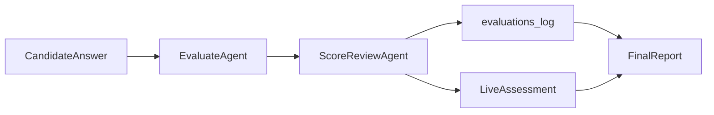

# AI 招聘助手 MVP

智能招聘演示系统：**A 薄入口（简历解析 + 匹配筛选）+ B 深主线（LangGraph 模拟面试 Agent）**。

## 功能概览

1. **上传**：先选/建 JD，再**上传并筛选**简历（PDF / DOCX / TXT）；首页左侧历史岗位可复用 JD，右侧可勾选要参与的简历

> **TXT 说明**：`.txt` 与 PDF/DOCX 同等支持。若筛选页显示 `failed` / `Unknown`，通常是 **LLM 结构化抽取**失败（非格式拒绝），可在 Network 或 `decision_summary` 查看原因；运行 `python scripts/diagnose_resume.py --file JL.txt` 本地复现。项目内 [`samples/yeyiwen_resume.txt`](samples/yeyiwen_resume.txt) + [`samples/shopee_jd.txt`](samples/shopee_jd.txt) 为 Markdown 模板回归用例。
2. **筛选（A 薄层）**：JD/简历结构化抽取 → 混合打分 → 追问包（3–5）→ 按需试题包（≥10）→ 决策建议
3. **面试（B 深主线）**：消费 A 层追问/试题种子，多轮 Agent 动态面试
4. **报告**：岗位匹配度、沟通能力、风险点、下轮建议；含 Self-reflection 修正

> **A 层与 B 层分工**：A 输出结构化决策与预生成考察提纲；B 负责动态多轮追问与终评。未推荐候选人也可进入模拟面试。

## A 层架构（智能简历解析与筛选引擎）

### 与阿里题目场景 A 的映射

| 题目要求 | 实现 |
|----------|------|
| 结构化提取 + 向量/结构化存储 | `ResumeStructured` / `JDStructured` → SQLite；摘要 embedding → Chroma |
| 智能匹配 0–100 + 理由 + 是否推进 | 40% 语义 + 60% LLM rubric；`dimension_scores` + `decision_summary` |
| 试题生成 ≥10 道 | `QuestionPack` 懒加载 API + 筛选页抽屉 |
| 追问模拟 3–5 道 | `FollowupPack` 筛选时同步生成 + 详情页展示 |

### 五阶段流水线

```
上传解析 → 结构化抽取 → 向量索引 → 混合打分 → 追问包/试题包
```

### A → B 交接

面试启动时，`InterviewService` 将 gaps、FollowupPack、QuestionPack 考察点注入 Agent persona，优先覆盖 A 层识别的模糊点与能力差距。

## B 层架构（LangGraph 模拟面试 Agent）

### 与阿里题目场景 B 的映射

| 题目要求 | 实现 |
|----------|------|
| 角色设定（技术总监 / HR） | `PersonaProfile` + LLM 化开场；tech_lead / hr_friendly 全链路一致 |
| 多轮对话 + 记忆 + 动态追问 | LangGraph `Evaluate → Route → FollowUp/Plan/Ask/Closing`；SQLite 消息 + running_summary |
| 非机械问答 | `TopicPlanner` 阶段规划 + competencies 覆盖追踪 |
| 实时评估报告 | LiveAssessment + **Evaluator/Calibrator 双 Agent** + 终局 Report + Self-reflection |

### 双轨评估（Evaluator + Calibrator）



- **EvaluateAgent**：静默评估回答质量、沟通信号、证据密度
- **ScoreReviewAgent**：招聘方视角校准分数与 confidence，纠正「水答高分」
- **LiveAssessment**：过程分（加权 + 规则封顶）
- **FinalReport**：多维度 + 过程 vs 终局对比 + 推进决策 rationale

### LangGraph 状态图

```
InitPersona → StreamOpening → WaitAnswer
  → EvaluateAnswer → ScoreReview → RouteDecision
    → StreamEncouragement | FollowUpQuestion | PlanNextTopic → AskQuestion | StreamClosing → GenerateReport
```

**双面试模式**（`InterviewConfig.interview_mode`）：

| 模式 | 适用场景 | 行为 |
|------|----------|------|
| `adaptive`（默认） | 深度评估、个性化追问 | TopicPlanner + A 层种子 + 动态追问 |
| `standardized` | 同岗公平比对、批量初筛 | 固定 QuestionPack 题序 + 每题固定 N 次追问 |

启动时可传完整 `InterviewConfig`（模式、人设、难度、严厉度/亲和度、追问上限、鼓励话术开关等），筛选页弹窗与 `POST /api/interview/start` 均支持。

**REST + SSE 映射**：

| 用户动作 | Graph 跃迁 |
|----------|------------|
| `POST /start` | InitPersona → pending=stream_opening |
| `GET /stream` | 执行 StreamOpening / FollowUp / Ask / Closing |
| `POST /message` | Evaluate → Route → Plan → 设置下一 pending |
| `POST /end` | GenerateReport |

### B 层 API（新增）

| 方法 | 路径 | 说明 |
|------|------|------|
| GET | `/api/interview/{id}/live` | 实时评估快照 |
| GET | `/api/interview/{id}/status` | phase、轮次、考察点覆盖、interview_mode/config |
| GET | `/api/interview/{id}/messages` | 历史消息（刷新恢复） |

### 面试编排规则

#### Adaptive（自适应，默认）

- **追问上限**：由 `InterviewConfig.max_followup_streak` 控制（0–3，默认 2）；同一话题连续追问达上限后强制换题，并将该考察点标记为 `at_risk`。
- **换题逻辑**：`TopicPlanner` 结合 phase、competencies 覆盖、A 层 followup 种子与 `force_new_topic` 信号规划下一话题；不因候选人答得快/慢而跳题。
- **阶段推进**：opening → technical → project → behavioral → closing，由轮次与覆盖度共同驱动。
- **评估字段**：Evaluate 输出 `followup_type`（clarify / deepen / quantify / challenge）与 `candidate_state`（confident / hesitant / stuck / evasive），追问 prompt 引用原话做自然承接。

#### Standardized（标准化）

- **题序固定**：启动时从 A 层 `QuestionPack` 预加载 `question_queue`（无 pack 时降级为 JD/competencies 固定列表）。
- **索引递增**：每输出一道新题（`stream_question`）`question_index += 1`；达 `standardized_question_limit` 或队列耗尽后进入 closing。
- **追问次数固定**：每题同样受 `max_followup_streak` 约束，但不调用 LLM TopicPlanner 换题。
- **公平性叙事**：同岗候选人面对相同主题顺序与追问配额，便于横向比对。

#### 鼓励话术与评分隔离

- 当 `candidate_state` 为 `hesitant` 或 `stuck`，且 `enable_encouragement=True` 时，路由至 `stream_encouragement`（每轮 evaluate 最多一次）。
- **Calibrator 不参与**鼓励消息；鼓励话术不抬高 Live/Final 分数。`hr_friendly` 默认开启，`tech_lead` 默认关闭。

### 双向反馈飞轮

- **招聘方侧（已有）**：终局报告 gaps → `_apply_feedback_loop` → `ResumeStructured.interview_feedback`
- **候选人侧（P1）**：报告页提交 1–5 星 + 简述 → `InterviewSession.candidate_feedback_json`（每 session 仅一次）
- **飞轮注入**：同岗位下次 `POST /start` 时，`_build_candidate_experience_flywheel` 将近期体验摘要拼入 `persona_prompt`（无需额外 LLM）
- 候选人反馈**不影响** Calibrator / 终局分数

### 历史岗位与报告列表

- JD 结构化结果、面试报告持久化于 SQLite（`jobs`、`interview_sessions.report_json`）。
- `GET /api/jobs`：岗位列表（简历数、面试数、完成数）。
- `GET /api/jobs/{id}/overview`：JD 摘要 + 该岗位下全部面试记录（匹配分、决策、简述）。
- 前端：[`history.html`](static/history.html) → [`job.html`](static/job.html) → [`report.html`](static/report.html)。

### 评分可审计性

- 每轮 `Evaluate → Calibrator → Live 加权` 后，`evaluations_log` 记录：
  - `live_job_fit_before/after`、`comm_before/after`、`job_fit_delta`、`comm_delta`
  - `score_adjustments[]`：维度、delta、理由、证据引用
- 报告 API 返回 `score_timeline`；报告页展示「评分时间线」。

### 面试输入安全

- [`input_guard.py`](app/services/interview/input_guard.py) 规则预检（jailbreak / prompt 泄露 / 越权指令）。
- 拦截后短路 Evaluate LLM，标记 `off_topic` + 低分，不抬高 Live/Final 分数。
- 追问/提问 Prompt 加固：不泄露 system prompt、不服从角色切换指令。

## 架构

```
static/ (HTML+CSS+JS)
    ↓ REST / SSE
FastAPI
    ├── DocumentParser → ResumeExtractor → MatchScorer → Chroma
    └── InterviewService → LangGraph nodes → Qwen (DashScope)
              ↓
         SQLite (会话/结构化数据)
```

## 快速开始

### 1. 环境要求

- Python 3.11+
- 通义千问 DashScope API Key
- （可选）火山引擎豆包语音 `X-Api-Key`，用于面试页语音模式

### 2. 安装

```bash
cd AL
python -m venv .venv

# Windows
.venv\Scripts\activate

pip install -r requirements.txt
cp .env.example .env
# 编辑 .env，填入 DASHSCOPE_API_KEY
# 语音模式（可选）：
# VOLC_SPEECH_API_KEY=<新版控制台 X-Api-Key>
# VOLC_ASR_RESOURCE_ID=volc.seedasr.sauc.duration
# VOLC_TTS_RESOURCE_ID=seed-tts-2.0
```

### 3. 启动

```bash
uvicorn app.main:app --reload --host 0.0.0.0 --port 8000
```

浏览器打开：http://localhost:8000

**首页流程**

1. 左侧点历史岗位，或「+ 新建」上传 JD
2. 右侧查看 JD 摘要 → 选择简历文件（可选勾选已有简历）→ **上传并筛选**
3. 若该岗位之前筛过 → **查看筛选结果**
4. 刷新页面后仍记住上次选中的 JD（localStorage）

**全站导航**

各页顶栏统一提供 **首页**、**完整历史**；主流程页有步骤条（已完成步骤可回跳）与 **← 返回上一步**：

| 页面 | 返回上一步 |
|------|------------|
| 筛选 | 返回选 JD（首页） |
| 面试 | 返回筛选（同岗位） |
| 报告 | 返回筛选；**继续面试下一位** 回到筛选列表 |

面试进行中离开会确认提示；`job_id` 随 URL 传递，报告 API 亦返回 `job_id` 作为兜底。

### 4. Demo 样本

`samples/` 目录提供了 JD 与两份对比简历（高匹配 / 低匹配）：

- `samples/job_description.txt`
- `samples/resume_good.txt`
- `samples/resume_poor.txt`

## API 一览

| 方法 | 路径 | 说明 |
|------|------|------|
| POST | `/api/jobs` | 上传 JD |
| GET | `/api/jobs` | 历史岗位列表（含 `jd_summary`、`has_structured`；首页左侧侧栏数据源） |
| DELETE | `/api/jobs/{id}` | 删除岗位及关联简历、筛选、面试记录 |
| GET | `/api/jobs/{id}/overview` | 岗位 JD 摘要 + 面试记录 |
| POST | `/api/resumes?job_id=` | 批量上传简历 |
| GET | `/api/jobs/{id}/resumes` | 岗位下简历列表（供首页勾选后筛选） |
| POST | `/api/screen/{job_id}` | 筛选；body `{ "resume_ids": [1,2] }` 仅筛选中简历；无 body 则筛全部 |
| GET | `/api/screen/{job_id}/results` | 筛选结果 |
| GET | `/api/screen/{job_id}/detail/{resume_id}` | 单候选人 A 层详情 |
| GET | `/api/screen/{job_id}/questions/{resume_id}` | 懒加载试题包（≥10） |
| GET | `/api/jobs/templates` | 岗位模板列表 |
| POST | `/api/jobs/{id}/rubric` | 上传公司打分细则 |
| POST | `/api/resumes/{id}/assessment-notes` | 补充测评/性格摘要 |
| GET | `/api/resumes/{resume_id}/structured` | 结构化 JSON |
| POST | `/api/interview/start` | 开始面试 |
| GET | `/api/interview/{id}/stream` | SSE 流式输出 |
| POST | `/api/interview/{id}/message` | 提交回答（含 live_assessment） |
| POST | `/api/interview/{id}/voice/turn` | 语音一轮：wav → ASR → LangGraph → TTS（返回 transcript + 文字 + mp3 base64） |
| GET | `/api/interview/{id}/live` | 实时评估快照 |
| GET | `/api/interview/{id}/status` | 面试状态 |
| GET | `/api/interview/{id}/messages` | 历史消息 |
| POST | `/api/interview/{id}/end` | 结束并生成报告 |
| POST | `/api/interview/{id}/feedback` | 候选人提交面试体验反馈（1–5 星 + 简述） |
| GET | `/api/interview/report/{id}` | 获取报告 |

## Prompt 设计思路

关键 Prompt 位于 `prompts/` 目录：

| 文件 | 用途 |
|------|------|
| `resume_extract.txt` | 结构化抽取，强调不臆造、模糊点写入 ambiguities |
| `jd_extract.txt` | JD 结构化：必备技能、年限、硬性条件 |
| `match_score.txt` | 维度 rubric 打分 + decision_summary |
| `followup_probe.txt` | 3–5 道简历追问 |
| `question_generate.txt` | ≥10 道预生成面试题 |
| `persona_init.txt` | PersonaProfile 结构化人设 |
| `opening_message.txt` | LLM 化风格化开场 |
| `followup_question.txt` | 同话题深度追问（引用原话承接） |
| `encouragement_message.txt` | 卡顿/紧张时 1–2 句鼓励（不影响评分） |
| `topic_planner.txt` | 阶段与下一话题规划（adaptive） |
| `ask_question.txt` | 新话题动态提问 |
| `score_review.txt` | Calibrator：校准分数与 confidence |
| `evaluate_answer.txt` | 静默评估：沟通信号/证据密度/招聘方严格标准 |
| `generate_report.txt` | 结构化评估报告 |
| `report_reflection.txt` | 报告 Self-reflection，修正矛盾 |

结构化输出统一走 `structured_completion()`：Pydantic 校验 → 失败重试 → JSON repair。

## 难点与解决方案

### 1. 多轮面试 Context 爆炸
- 完整对话存 SQLite；每 3 轮 LLM 压缩为 `running_summary`
- System prompt 始终锚定 JD 摘要 + 结构化简历 + ambiguities

### 2. LLM JSON 不稳定
- DashScope `response_format: json_object` + Pydantic 校验
- 失败后追加纠错 prompt 重试（最多 2 次）

### 3. 流式 SSE 与同步 LLM
- 后台线程生产 token，async 生成器通过 Queue 转发给 SSE
- 前端 `EventSource` 消费，打字机效果

### 4. 混合匹配分
- 语义分（Chroma cosine × 40%）+ LLM rubric 分（× 60%）
- 双阈值：`final_score >= 60` 且 `recommend_interview=true` 标记为「推荐面试」；未推荐仍可进入模拟面试体验 B 层 Agent

### 5. 语音面试 MVP（P2）
- 面试页可切换 **文字 / 语音**；语音模式按住说话，松手提交 16 kHz WAV
- 后端：`openspeech` ASR WebSocket（`bigmodel_nostream`）→ 现有 `submit_answer` + LangGraph → TTS HTTP SSE
- 鉴权：新版控制台仅需 `X-Api-Key`（`VOLC_SPEECH_API_KEY`），无需 AppId / Access Token
- 文本模式仍为默认；未配置语音 Key 时 `/voice/turn` 返回 503，不影响文字面试

## Demo 视频脚本（≥2 分钟）

**A 段（约 40s）**
1. 左侧选 JD（或新建）→ 上传简历并筛选
2. 筛选列表对比分数、维度分、decision_summary
3. 展开详情：追问建议 3–5 条
4. 点击「生成试题」展示 ≥10 道预生成题

**B 段（约 80s）**
5. 选择 tech_lead / hr_friendly → 对比 **风格化开场**
6. 故意 vague 回答 → **沟通分被压低** + 同话题追问（最多 2 次后换题）
7. 侧栏 **Live 评估**（含 confidence）+ 考察点三态
8. 结束 → 报告 **过程 vs 终局** + 多维度 + 招聘决策 rationale

## 演进路线（v1.1）

- 岗位模板：`templates/tech_backend.json`、`product_manager.json`（已内置）
- 公司打分细则：`POST /api/jobs/{id}/rubric`
- 测评摘要：`POST /api/resumes/{id}/assessment-notes`

## 技术栈

- **后端**：FastAPI, SQLAlchemy, LangGraph, DashScope (Qwen)
- **向量**：Chroma（本地持久化）
- **前端**：原生 HTML / CSS / JavaScript
- **文档解析**：PyMuPDF, python-docx

## 项目结构

```
app/
  main.py           # FastAPI 入口
  api/              # REST + SSE 路由
  services/         # 业务逻辑
    interview/      # LangGraph 面试 Agent
static/             # 前端静态页
prompts/            # Prompt 模板
samples/            # Demo 样例文件
data/               # SQLite + Chroma（运行时生成，已 gitignore）
```

## License

MIT — 仅供笔试 Demo 使用
