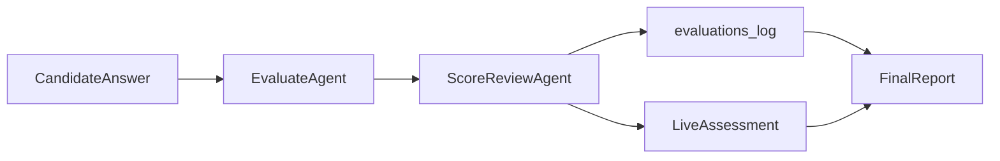

# AI 招聘助手 MVP

智能招聘演示系统：**A 薄入口（简历解析 + 匹配筛选）+ B 深主线（LangGraph 模拟面试 Agent）**。

## 功能概览

1. **上传**：JD + 多份简历（PDF / DOCX / TXT）
2. **筛选（A 薄层）**：JD/简历结构化抽取 → 混合打分 → 追问包（3–5）→ 按需试题包（≥10）→ 决策建议
3. **面试（B 深主线）**：消费 A 层追问/试题种子，多轮 Agent 动态面试
4. **报告**：岗位匹配度、沟通能力、风险点、下轮建议；含 Self-reflection 修正

> **A 层与 B 层分工**：A 输出结构化决策与预生成考察提纲；B 负责动态多轮追问与终评。未推荐候选人也可进入模拟面试。

## A 层架构（智能简历解析与筛选引擎）

### 与阿里题目场景 A 的映射

| 题目要求 | 实现 |
|----------|------|
| 结构化提取 + 向量/结构化存储 | `ResumeStructured` / `JDStructured` → SQLite；摘要 embedding → Chroma |
| 智能匹配 0–100 + 理由 + 是否推进 | 40% 语义 + 60% LLM rubric；`dimension_scores` + `decision_summary` |
| 试题生成 ≥10 道 | `QuestionPack` 懒加载 API + 筛选页抽屉 |
| 追问模拟 3–5 道 | `FollowupPack` 筛选时同步生成 + 详情页展示 |

### 五阶段流水线

```
上传解析 → 结构化抽取 → 向量索引 → 混合打分 → 追问包/试题包
```

### A → B 交接

面试启动时，`InterviewService` 将 gaps、FollowupPack、QuestionPack 考察点注入 Agent persona，优先覆盖 A 层识别的模糊点与能力差距。

## B 层架构（LangGraph 模拟面试 Agent）

### 与阿里题目场景 B 的映射

| 题目要求 | 实现 |
|----------|------|
| 角色设定（技术总监 / HR） | `PersonaProfile` + LLM 化开场；tech_lead / hr_friendly 全链路一致 |
| 多轮对话 + 记忆 + 动态追问 | LangGraph `Evaluate → Route → FollowUp/Plan/Ask/Closing`；SQLite 消息 + running_summary |
| 非机械问答 | `TopicPlanner` 阶段规划 + competencies 覆盖追踪 |
| 实时评估报告 | LiveAssessment + **Evaluator/Calibrator 双 Agent** + 终局 Report + Self-reflection |

### 双轨评估（Evaluator + Calibrator）



- **EvaluateAgent**：静默评估回答质量、沟通信号、证据密度
- **ScoreReviewAgent**：招聘方视角校准分数与 confidence，纠正「水答高分」
- **LiveAssessment**：过程分（加权 + 规则封顶）
- **FinalReport**：多维度 + 过程 vs 终局对比 + 推进决策 rationale

### LangGraph 状态图

```
InitPersona → StreamOpening → WaitAnswer
  → EvaluateAnswer → ScoreReview → RouteDecision
    → FollowUpQuestion | PlanNextTopic → AskQuestion | StreamClosing → GenerateReport
```

**REST + SSE 映射**：

| 用户动作 | Graph 跃迁 |
|----------|------------|
| `POST /start` | InitPersona → pending=stream_opening |
| `GET /stream` | 执行 StreamOpening / FollowUp / Ask / Closing |
| `POST /message` | Evaluate → Route → Plan → 设置下一 pending |
| `POST /end` | GenerateReport |

### B 层 API（新增）

| 方法 | 路径 | 说明 |
|------|------|------|
| GET | `/api/interview/{id}/live` | 实时评估快照 |
| GET | `/api/interview/{id}/status` | phase、轮次、考察点覆盖 |
| GET | `/api/interview/{id}/messages` | 历史消息（刷新恢复） |

## 架构

```
static/ (HTML+CSS+JS)
    ↓ REST / SSE
FastAPI
    ├── DocumentParser → ResumeExtractor → MatchScorer → Chroma
    └── InterviewService → LangGraph nodes → Qwen (DashScope)
              ↓
         SQLite (会话/结构化数据)
```

## 快速开始

### 1. 环境要求

- Python 3.11+
- 通义千问 DashScope API Key

### 2. 安装

```bash
cd AL
python -m venv .venv

# Windows
.venv\Scripts\activate

pip install -r requirements.txt
cp .env.example .env
# 编辑 .env，填入 DASHSCOPE_API_KEY
```

### 3. 启动

```bash
uvicorn app.main:app --reload --host 0.0.0.0 --port 8000
```

浏览器打开：http://localhost:8000

### 4. Demo 样本

`samples/` 目录提供了 JD 与两份对比简历（高匹配 / 低匹配）：

- `samples/job_description.txt`
- `samples/resume_good.txt`
- `samples/resume_poor.txt`

## API 一览

| 方法 | 路径 | 说明 |
|------|------|------|
| POST | `/api/jobs` | 上传 JD |
| POST | `/api/resumes?job_id=` | 批量上传简历 |
| POST | `/api/screen/{job_id}` | 触发筛选 |
| GET | `/api/screen/{job_id}/results` | 筛选结果 |
| GET | `/api/screen/{job_id}/detail/{resume_id}` | 单候选人 A 层详情 |
| GET | `/api/screen/{job_id}/questions/{resume_id}` | 懒加载试题包（≥10） |
| GET | `/api/jobs/templates` | 岗位模板列表 |
| POST | `/api/jobs/{id}/rubric` | 上传公司打分细则 |
| POST | `/api/resumes/{id}/assessment-notes` | 补充测评/性格摘要 |
| GET | `/api/resumes/{resume_id}/structured` | 结构化 JSON |
| POST | `/api/interview/start` | 开始面试 |
| GET | `/api/interview/{id}/stream` | SSE 流式输出 |
| POST | `/api/interview/{id}/message` | 提交回答（含 live_assessment） |
| GET | `/api/interview/{id}/live` | 实时评估快照 |
| GET | `/api/interview/{id}/status` | 面试状态 |
| GET | `/api/interview/{id}/messages` | 历史消息 |
| POST | `/api/interview/{id}/end` | 结束并生成报告 |
| GET | `/api/interview/report/{id}` | 获取报告 |

## Prompt 设计思路

关键 Prompt 位于 `prompts/` 目录：

| 文件 | 用途 |
|------|------|
| `resume_extract.txt` | 结构化抽取，强调不臆造、模糊点写入 ambiguities |
| `jd_extract.txt` | JD 结构化：必备技能、年限、硬性条件 |
| `match_score.txt` | 维度 rubric 打分 + decision_summary |
| `followup_probe.txt` | 3–5 道简历追问 |
| `question_generate.txt` | ≥10 道预生成面试题 |
| `persona_init.txt` | PersonaProfile 结构化人设 |
| `opening_message.txt` | LLM 化风格化开场 |
| `followup_question.txt` | 同话题深度追问 |
| `topic_planner.txt` | 阶段与下一话题规划 |
| `ask_question.txt` | 新话题动态提问 |
| `score_review.txt` | Calibrator：校准分数与 confidence |
| `evaluate_answer.txt` | 静默评估：沟通信号/证据密度/招聘方严格标准 |
| `generate_report.txt` | 结构化评估报告 |
| `report_reflection.txt` | 报告 Self-reflection，修正矛盾 |

结构化输出统一走 `structured_completion()`：Pydantic 校验 → 失败重试 → JSON repair。

## 难点与解决方案

### 1. 多轮面试 Context 爆炸
- 完整对话存 SQLite；每 3 轮 LLM 压缩为 `running_summary`
- System prompt 始终锚定 JD 摘要 + 结构化简历 + ambiguities

### 2. LLM JSON 不稳定
- DashScope `response_format: json_object` + Pydantic 校验
- 失败后追加纠错 prompt 重试（最多 2 次）

### 3. 流式 SSE 与同步 LLM
- 后台线程生产 token，async 生成器通过 Queue 转发给 SSE
- 前端 `EventSource` 消费，打字机效果

### 4. 混合匹配分
- 语义分（Chroma cosine × 40%）+ LLM rubric 分（× 60%）
- 双阈值：`final_score >= 60` 且 `recommend_interview=true` 标记为「推荐面试」；未推荐仍可进入模拟面试体验 B 层 Agent

## Demo 视频脚本（≥2 分钟）

**A 段（约 40s）**
1. 上传 JD + 2 份简历
2. 筛选列表对比分数、维度分、decision_summary
3. 展开详情：追问建议 3–5 条
4. 点击「生成试题」展示 ≥10 道预生成题

**B 段（约 80s）**
5. 选择 tech_lead / hr_friendly → 对比 **风格化开场**
6. 故意 vague 回答 → **沟通分被压低** + 同话题追问（最多 2 次后换题）
7. 侧栏 **Live 评估**（含 confidence）+ 考察点三态
8. 结束 → 报告 **过程 vs 终局** + 多维度 + 招聘决策 rationale

## 演进路线（v1.1）

- 岗位模板：`templates/tech_backend.json`、`product_manager.json`（已内置）
- 公司打分细则：`POST /api/jobs/{id}/rubric`
- 测评摘要：`POST /api/resumes/{id}/assessment-notes`

## 技术栈

- **后端**：FastAPI, SQLAlchemy, LangGraph, DashScope (Qwen)
- **向量**：Chroma（本地持久化）
- **前端**：原生 HTML / CSS / JavaScript
- **文档解析**：PyMuPDF, python-docx

## 项目结构

```
app/
  main.py           # FastAPI 入口
  api/              # REST + SSE 路由
  services/         # 业务逻辑
    interview/      # LangGraph 面试 Agent
static/             # 前端静态页
prompts/            # Prompt 模板
samples/            # Demo 样例文件
data/               # SQLite + Chroma（运行时生成，已 gitignore）
```

## License

MIT — 仅供笔试 Demo 使用
